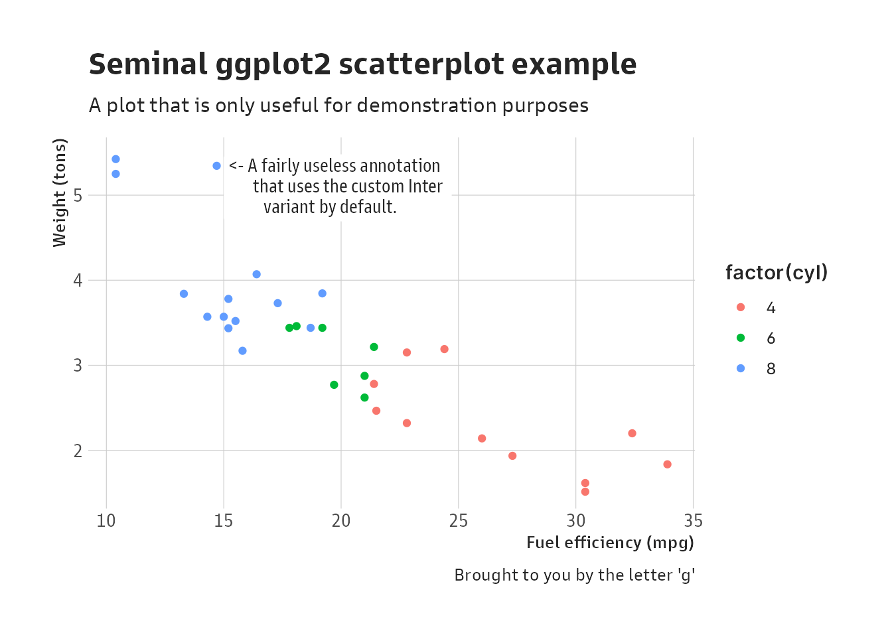

[](https://www.repostatus.org/#active)
[](https://keybase.io/hrbrmstr)

[](https://travis-ci.org/hrbrmstr/hrbragg)  


# hrbragg

Typography-centric Themes, Theme Components, and Utilities for ‘ggplot2’
and ‘ragg’.

## Description

The ‘ragg’, ‘systemfonts’, and ‘textshaping’ packages make it possible
to create plot components and themes that make full use of the rich
typography features in modern fonts. Fonts, themes, and utilities are
provided to create ‘ggplot2’ plots intended for rendering on ‘ragg’
graphics devices.

## What’s Inside The Tin

The following functions are implemented:

-   `adaptive_color`: Adaptive colors colors for hrbragg themes
-   `elb`: Shortcut for element\_blank
-   `ell`: Shortcut for element\_line
-   `elr`: Shortcut for element\_rect
-   `elt`: Shortcut for element\_text
-   `feature_dict`: OpenType feature description lookup table
-   `gs_pkg`: Goldman Sans & Goldman Sans Condensed Font Variants
-   `install_goldman_sans`: Install Goldman Sans
-   `install_inter`: Install Inter
-   `install_roboto_condensed`: Install Roboto Condensed
-   `inter_pkg`: Inter Font Variants
-   `opentype_typographic_features`: OpenType Typographic Features
-   `preview_variant`: Preview numbers, kerning, and ligatures from font
    variants you create
-   `rc_pkg`: Roboto Condensed Font Variants
-   `reconfigure_font`: Create an complete, alternate font family with
    the same customized features
-   `reset_ggplot2_defaults`: Restore all ggplot2 geom to default
    aesthetics
-   `scale_x_percent`: X & Y scales with opinionated pre-sets for
    percent & comma label formats
-   `theme_gs`: ggplot2 Theme Based On The Goldman Sans Font Family
-   `theme_inter`: ggplot2 Theme Based On The Inter Font Family
-   `theme_rc`: ggplot2 Theme Based On The Roboto Condensed Font Family

## Installation

``` r
remotes::install_git("https://git.rud.is/hrbrmstr/hrbragg.git")
# or
remotes::install_gitlab("hrbrmstr/hrbragg")
# or
remotes::install_bitbucket("hrbrmstr/hrbragg")
# or
remotes::install_github("hrbrmstr/hrbragg")
```

NOTE: To use the ‘remotes’ install options you will need to have the
[{remotes} package](https://github.com/r-lib/remotes) installed.

## Usage

``` r
library(tibble)
library(hrbragg)
library(ggplot2)

# current version
packageVersion("hrbragg")
## [1] '0.1.0'
```

For the moment, you’ll need to install Inter:

``` r
install_inter()
```

### Inspect the definitions of the feature codes:

``` r
str(inter_pkg, 1)
## List of 17
##  $ ultralight       : chr "hrbragg-pkg tab Inter Thin"
##  $ ultralight_italic: chr "hrbragg-pkg tab Inter Thin Italic"
##  $ light            : chr "hrbragg-pkg tab Inter Extra Light"
##  $ light_italic     : chr "hrbragg-pkg tab Inter Extra Light Italic"
##  $ normal_italic    : chr "hrbragg-pkg tab Inter Light Italic"
##  $ normal           : chr "hrbragg-pkg tab Inter Regular"
##  $ normal_light     : chr "hrbragg-pkg tab Inter Light"
##  $ medium_italic    : chr "hrbragg-pkg tab Inter Medium Italic"
##  $ medium           : chr "hrbragg-pkg tab Inter Medium"
##  $ semibold_italic  : chr "hrbragg-pkg tab Inter Semi Bold Italic"
##  $ semibold         : chr "hrbragg-pkg tab Inter Semi Bold"
##  $ bold             : chr "hrbragg-pkg tab Inter Bold"
##  $ bold_italic      : chr "hrbragg-pkg tab Inter Bold Italic"
##  $ ultrabold        : chr "hrbragg-pkg tab Inter Extra Bold"
##  $ ultrabold_italic : chr "hrbragg-pkg tab Inter Extra Bold Italic"
##  $ heavy            : chr "hrbragg-pkg tab Inter Black"
##  $ heavy_italic     : chr "hrbragg-pkg tab Inter Black Italic"
##  - attr(*, "family")= chr "Inter"

data("feature_dict")

feature_dict[feature_dict$tag %in% textshaping::get_font_features("Inter")[[1]],]
## # A tibble: 19 x 3
##    tag   long_name                 description                                                                          
##    <chr> <chr>                     <chr>                                                                                
##  1 aalt  Access All Alternates     Special feature: used to present user with choice all alternate forms of the charact…
##  2 calt  Contextual Alternates     Applies a second substitution feature based on a match of a character pattern within…
##  3 case  Case Sensitive Forms      Replace characters, especially punctuation, with forms better suited for all-capital…
##  4 ccmp  Glyph Composition/Decomp… Either calls a ligature replacement on a sequence of characters or replaces a charac…
##  5 cpsp  Capital Spacing           Adjusts spacing between letters in all-capitals text                                 
##  6 dlig  Discretionary Ligatures   Ligatures to be applied at the user's discretion                                     
##  7 dnom  Denominator               Converts to appropriate fraction denominator form, invoked by frac                   
##  8 frac  Fractions                 Converts figures separated by slash with diagonal fraction                           
##  9 kern  Kerning                   Fine horizontal positioning of one glyph to the next, based on the shapes of the gly…
## 10 locl  Localized Forms           Substitutes character with the preferred form based on script language               
## 11 mark  Mark Positioning          Fine positioning of a mark glyph to a base character                                 
## 12 numr  Numerator                 Converts to appropriate fraction numerator form, invoked by frac                     
## 13 ordn  Ordinals                  Replaces characters with ordinal forms for use after numbers                         
## 14 pnum  Proportional Figures      Replaces numerals with glyphs of proportional width, often also onum                 
## 15 salt  Stylistic Alternates      Either replaces with, or displays list of, stylistic alternatives for a character    
## 16 subs  Subscript                 Replaces character with subscript version, cf. numr                                  
## 17 sups  Superscript               Replaces character with superscript version, cf. dnom                                
## 18 tnum  Tabular Figures           Replaces numerals with glyphs of uniform width, often also lnum                      
## 19 zero  Slashed Zero              Replaces 0 figure with slashed 0
```

### Let’s make a plot!

``` r
ggplot() +
  geom_point(
    data = mtcars,
    aes(mpg, wt, color = factor(cyl))
  ) +
  geom_label(
    aes(
      x = 15, y = 5.48,
      label = "<- A fairly useless annotation\n       that uses the custom Inter\n          variant by default."
    ),
    label.size = 0, hjust = 0, vjust = 1
  ) +
  labs(
    x = "Fuel efficiency (mpg)", y = "Weight (tons)",
    title = "Seminal ggplot2 scatterplot example",
    subtitle = "A plot that is only useful for demonstration purposes",
    caption = "Brought to you by the letter 'g'"
  ) -> gg1
```

### Dark & light mode support with just a parameter change!

``` r
gg1 + theme_inter(grid = "XY", mode = "dark") 
```


Note the ligatures aren’t as nice in Goldman Sans

``` r
gg1 + theme_rc(grid = "XY", mode = "dark") 
```


### Note the ligatures aren’t as nice in or Roboto Condensed

``` r
gg1 + theme_gs(grid = "XY", mode = "dark") 
```


``` r
gg1 + theme_inter(grid = "XY", mode = "light") 
```


``` r
gg1 + theme_rc(grid = "XY", mode = "light") 
```


``` r
gg1 + theme_gs(grid = "XY", mode = "light") 
```



### Making sure we got all the various plot components styled

``` r
ggplot() +
  geom_point(
    data = mpg,
    aes(displ, hwy, color = trans)
  ) +
  facet_wrap(
    vars(cyl, drv), scales = "free", drop = TRUE
  ) +
  labs(
    x = "Displacement", y = "Highway",
    title = "Another seminal ggplot2 scatterplot example",
    subtitle = "A plot that is only useful for demonstration purposes",
    caption = "Brought to you by the letter 'g'"
  ) -> gg2
```

``` r
gg2 + theme_inter(grid = "XY", mode = "light") 
```


``` r
gg2 + theme_inter(grid = "XY", mode = "dark") 
```


### Here’s a way to preview any variants you create:

``` r
preview_variant(inter_pkg)
```


``` r
reconfigure_font(
  family = "Trattatello",
  width = "normal",
  ligatures = "discretionary",
  calt = 1, tnum = 1, case = 1,
  dlig = 1, kern = 1,
  zero = 0, salt = 0
) -> trat

preview_variant(trat)
```


``` r
reconfigure_font(
  family = "Barlow",
  width = "normal",
  ligatures = "standard",
  tnum = 1, kern = 1
) -> barlow

preview_variant(barlow)
```


## hrbragg Metrics

| Lang | \# Files |  (%) |  LoC |  (%) | Blank lines |  (%) | \# Lines |  (%) |
|:-----|---------:|-----:|-----:|-----:|------------:|-----:|---------:|-----:|
| SVG  |        1 | 0.02 | 2574 | 0.35 |           0 | 0.00 |        0 | 0.00 |
| R    |       21 | 0.46 |  977 | 0.13 |         158 | 0.39 |      679 | 0.46 |
| Rmd  |        1 | 0.02 |   75 | 0.01 |          43 | 0.11 |       67 | 0.04 |
| SUM  |       23 | 0.50 | 3626 | 0.50 |         201 | 0.50 |      746 | 0.50 |

clock Package Metrics for hrbragg

## Code of Conduct

Please note that this project is released with a Contributor Code of
Conduct. By participating in this project you agree to abide by its
terms.
